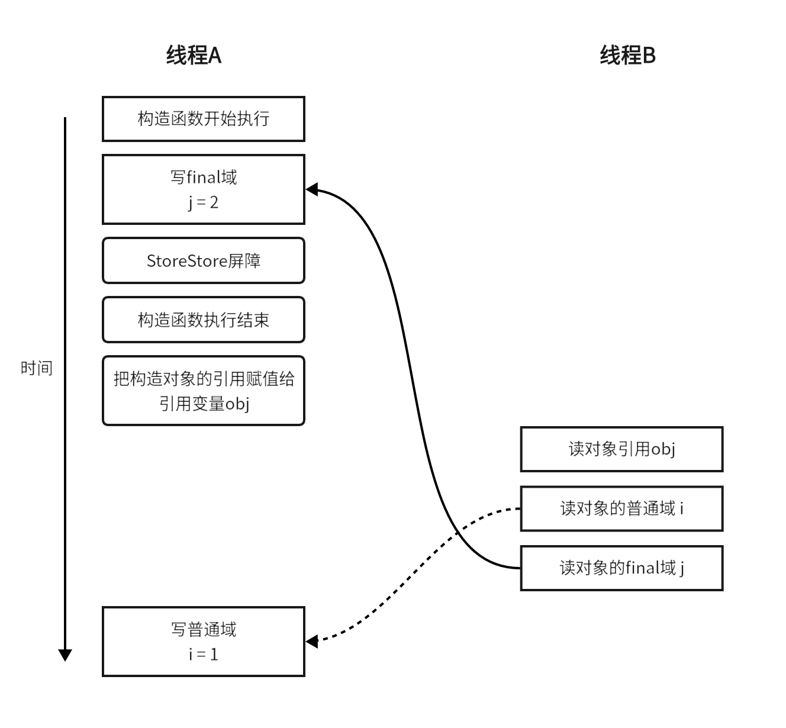
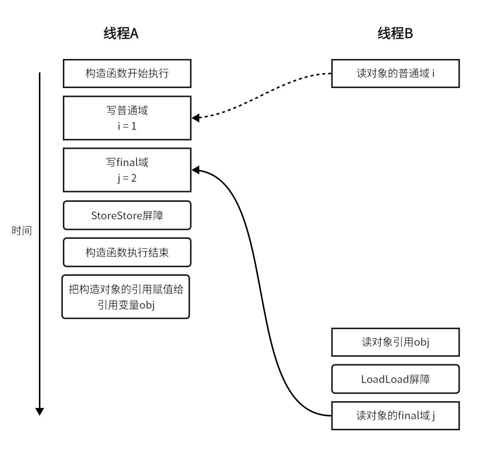
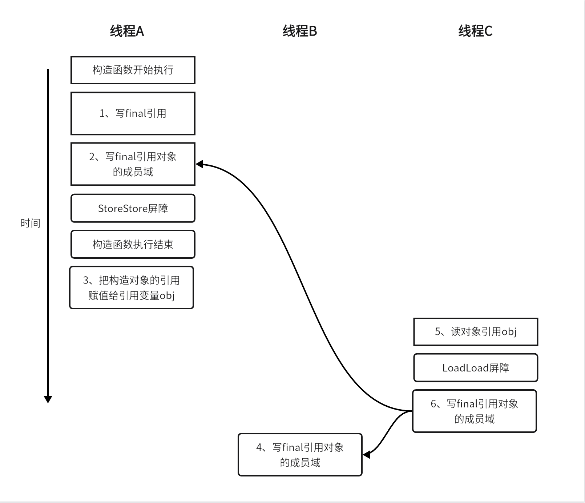
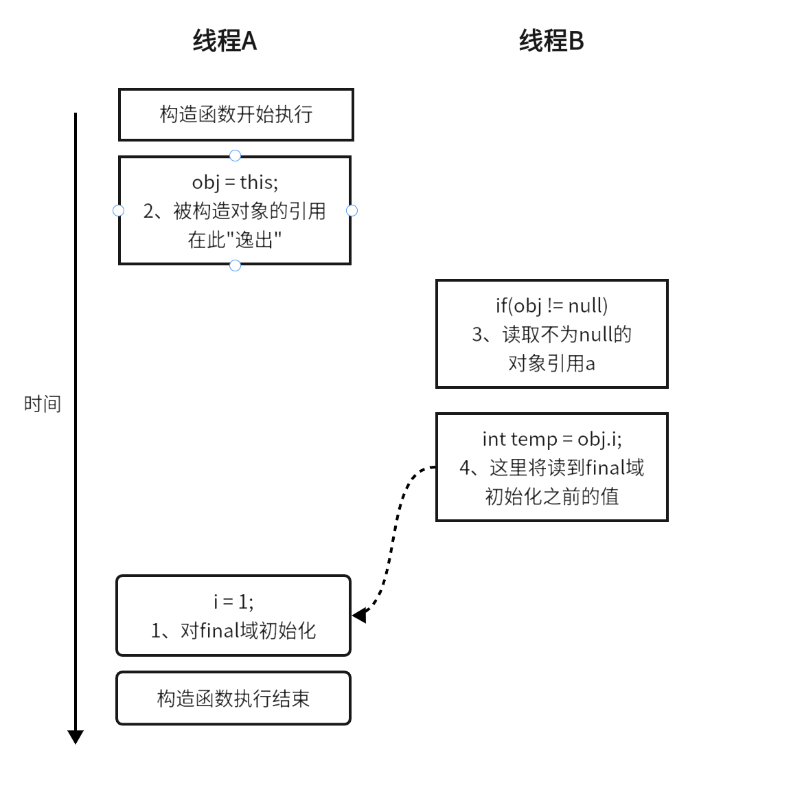
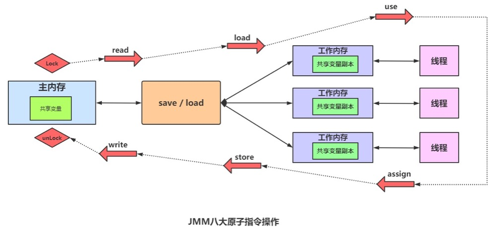

# JMM内存模型

> 本文章为个人总结，如有疑惑点，欢迎互相学习。

## 定义

JMM内存模型规定了一个线程如何以及何时可以看到其他线程修改过后的共享变量的值，以及如何同步地访问获取共享变量值。围绕原子性、有序性、可见性三大特性展开。

> 前提：对于硬件，所有的线程栈和堆都分布在主内存中。部分线程栈和堆可能有时候会出现在CPU缓存中和CPU内部的寄存器中

### 三大特性
####  原子性

JMM内存模型定义了[八种原子性操作](#八大原子操作)来完成主内存与工作内存之间的交互，并且操作必须满足[多条规则](#八大原子操作规则)保证操作的顺序性，但是并未规定操作必须连续执行。所以在单线程程序执行时，JMM可以保证执行结果与顺序一致性模型中的结果相同。但是在多线程程序执行时，会有可见性以及有序性问题。

#### 可见性

CPU与主存运行速度的差异所以引入高速缓存（工作内存），但是高速缓存的引入也让多线程访问共享变量多了可见性的问题。多线程程序执行时候，一个线程修改了共享变量的值时，其他线程需要感知到这个修改，如果当前自己自己有使用，就需要做相应操作。

#### 有序性

编译器和处理器进行优化导致的重排序问题，因为程序中的操作都不是原子性的，例如new一个对象，对其申请内存、赋值等一系列复杂操作不是整体的原子操作，所以对指令优化可以对不影响结果的前提下进行指令重排序，例如多个变量统一申请内存，可以增加单线程执行效率。但是多线程执行时候，指令重排序会造成执行结果不同。

### volatile

#### 语义
可见性：对一个volatile变量的读，总是能看到对这个变量最后的写入
原子性：对任意单个volatile变量的读/写具有原子性，但类似于i++这种复合操作不具有原子性
有序性：对volatile修饰的变量的读写操作前后加上各种特定的内存屏障来禁止重排序

#### JMM规则
volatile修饰的变量的read、load、use操作和assign、store、write必须是连续的，即修改后必须立即同步回主内存，使用时必须从主内存刷新，由此保证操作volatile变量是多线程的可见的。

#### 操作系统实现

##### 术语

- **缓存锁定：** 通过Lock前缀指令，会锁定变量缓存行区域并写回主内存。
- **缓存一致性机制：** 阻止 **同时** 修改被两个以上处理器缓存的内存区域数据。一个处理器的缓存回写会导致其他处理器的缓存无效。
- **伪共享：** 如果多个核的线程在操作同一个缓存行中的不同变量数据，那么就会出现频繁的缓存失效，即使在代码层面看这两个线程操作的数据之间完全没有关系。这种不合理的资源竞争情况就是伪共享。
  - Jdk1.7时，可以添加空变量进行缓存行填充
  - Jdk1.8时，添加注解以及配置jvm参数可以解决伪共享

##### 缓存一致性要求

- [写传播](#写传播)：一个处理器对于某个内存位置所做的写操作，对于其他处理器是能感知到的。
    
例如a、b两个处理器对位置x的读取，当c处理器对位置x写操作后。a和b需要能感知到，并对位置x的值读取结果为c处理器写入后的值。这就是写传播。

- [事务串行化](#事务串行化)：对同一内存单元的所有写操作都能串行化。即所有的处理器能以相同的次序看到这些写操作。

当a、b处理器对位置x的读取，c和d处理器对位置x顺序写操作后，a、b处理器对位置x的值读取结果应为d处理器最后写入的值，不能是c处理器的值，这就是事务串行化。

##### 缓存一致性机制

##### 写传播

- **窥探机制：** [总线嗅探](#总线嗅探)广播形式，所有处理器能感知到所有活动

  - 优点：速度更快
  - 缺点：不可扩展，随着系统变大，总线的大小以及带宽必须增加

- **基于目录的机制：** 点对点，总线事件只会发给感兴趣的 CPU (借助 directory)。>64处理器使用这种类型的缓存一致性机制

  - 优点：使用更少带宽
  - 缺点：有更长的延迟

##### 事务串行化

- **总线仲裁机制**

总线会同步试图并发使用总线的事务。在一个处理器执行总线事务期间，总线会 禁止其他的处理器和I/O设备执行内存的读/写。总线的这种工作机制可以把所有处理器对内存的访问以串行化的方式来执行。在任意时间点，最多只能有一个处理器可以访问内存。这个特性确保了**单个总线事务**之中的内存读/写操作具有原子性。处理器会自动保证基本的内存操作的原子性，也就是一个处理器从内存中读取或者写入一个字节时，其他处理器是不能访问这个字节的内存地址。同时处理器提供**总线锁定**和**缓存锁定**两个机制来保证复杂内存操作的原子性。 

- **总线锁定**

总线锁定就是使用处理器提供的一个 LOCK＃信号，当其中一个处理器在总线上输出此信号时，其它处理器的请求将被阻塞住，那么该处理器可以独占共享内存。

- **缓存锁定**

1、[Lock操作](#八大原子操作)期间锁定缓存行范围
2、不会在总线上声言[LOCK＃](#lock操作lock指令lock-信号)信号，也就不会进行总线锁定
3、使用缓存一致性协议通知其他处理器缓存失效：[MESI]()

> 缓存锁定不能用场景
> - 当操作的数据不能被缓存在处理器内部，或操作的数据跨多个缓存行时，则处理器会调用总线锁定。 
> - 有些处理器不支持缓存锁定。目前大多数处理器都已支持缓存锁定。

#### 重排序

**概念：** 只要程序的最终结果与顺序化执行的结果一致，那么执行的顺序可以与代码的顺序不一致，此过程叫做重排序。

1、编译器优化的重排序。编译器在不改变单线程程序语义的前提下，可以重新安排语句顺序。
2、指令级并行的重排序。现代处理器采用指令级并行技术（ISP）来将多条指令重叠执行。如果数据不存在数据依赖性，处理器可以改变语句对应机器指令的执行顺序。
3、内存系统的重排序。由于处理器使用缓存和读/写缓冲区，这使得store和load操作看上去可能是在乱序执行。
> 1：属于[编译器](#编译器)重排序  
> 2和3：属于[处理器](#处理器)重排序

对于编译器，JMM的"编译器重排序规则"会禁止**特定类型**的"编译器重排序"(不是所有“编译器重排序”都被禁止)
对于处理器，JMM的处理器重排序会要求Java编译器在生成指定序列时，插入特定类型的[内存屏障](#内存屏障)指令，通过内存屏障指令来禁止**特定类型**的"处理器重排序"

JMM属于语言级的内存模型，通过禁止特定类型的编译器和处理器重排序，提供一致的内存可见性。


##### as-if-serial 语义（像是有序的）

**含义：** 无论如何重排序，程序的最终执行结果是不能变的。
所以，在这个语义下，**编译器** 为了保持这个语义，不会去对存在有数据依赖关系的操作进行重排序，如果数据之间不存在依赖关系，这些操作就会被操作系统进行最大的优化，进行重排序，使得代码的执行效率更高。

##### happens-before 原则

Java并发编程必须要保证代码的原子性，有序性，可见性，如果只靠sychronized和volatile关键字来保证它，那么 **程序员的代码** 写起来就显的相当的麻烦，从JDK 5开始，Java使用新的JSR-133内存模型，提供了happens-before 原则来辅助保证程序执行的原子性、可见性以及有序性的问题，它是判断数据是否存在竞争、线程是否安全的依据。

##### happens-before 原则的八大子原则

- **程序顺序原则：** 在一个程序中的代码执行顺序是有序的，即使出现重排序，也会保证在单线程下的结果是一致的。
- **锁原则：** 在同一段程序中，要想对这段程序加锁，必须是前一段锁已经解锁了，才能对这段程序继续加锁。
- **volatile变量原则：** 如果一个线程先去写一个volatile变量，那么它必须先去读这一个变量，所以，在任何情况下volatile修饰的变量的值在修改时都是多其他线程是可见的。
- **线程启动原则：** 在主线程A执行过程中，启动子线程B，那么线程A在启动子线程B之前对共享变量的修改结果对线程B可见。
- **线程终止原则：** 在主线程A执行过程中，子线程B终止，那么线程B在终止之前对共享变量的修改结果在线程A中可见。
- **线程中断原则：** 对线程 interrupt()方法的调用先行发生于被中断线程的代码检测到中断事件的发生，可以通过Thread.interrupted()方法检测线程是否中断。
- **传递性原则：** 假设A先于B，B先于C，那么A必须先于C。
- **终结原则：** 一个对象的初始化完成先于他的finalize方法调用。

##### 内存屏障

屏障类型 | 指令示例 | 说明
---|---|---
LoadLoad | Load1; LoadLoad; Load2 | 保证load1的读取操作在load2及后续读取操作之前执行
StoreStore | Store1; StoreStore; Store2 | 在store2及其后的写操作执行前，保证store1的写操作已刷新到主内存
LoadStore | Load1; LoadStore; Store2 | 在stroe2及其后的写操作执行前，保证load1的读操作已读取结束
StoreLoad | Store1; StoreLoad; Load2 | 保证store1的写操作已刷新到主内存之后，load2及其后的读操作才能执行

此处的load和store是原子操作中的load操作和store操作。

##### 总结

as-if-serial是语义。所有重排序规则的定义都基于此语义之上。
happens-before原则，是给到程序员的原则。在程序员编写代码时，无需考虑这些原则中的包含重排序规则。是对于编译器重排序的限制。
内存屏障，是实际落地的技术。在Java层面可以使用Unsafe中的 loadFence、storeFence、fullFence 进行手动添加内存屏障。对于处理器重排序的限制，

#### final

对于final域，编译器和处理器要遵守两个重排序规则。

- 写final域的重排序规则：在构造函数内对一个final域的写入，与随后把这个被构造对象的引用赋值给一个引用变量，这两个操作之间不能重排序。(禁止把final域的写操作重排序到构造函数之外)
- 读final域的重排序规则：初次读一个包含final域的对象的引用，与随后初次读这个final域，这两个操作之间不能重排序。

```
public class FinalExample {
       int i;//普通域
       final int j;//final域
       static FinalExample obj;
 
       public FinalExample () {
              i = 1;//写普通域。对普通域的写操作【可能会】被重排序到构造函数之外
              j = 2;//写final域。对final域的写操作【不会】被重排序到构造函数之外
       }
 
       // 写线程A执行
       public static void writer () {　
              obj = new FinalExample ();
       }
 
       // 读线程B执行
       public static void reader () {　
              FinalExample object = obj;//读对象引用
              int a = object.i;//读普通域。可能会看到结果为0(由于i=1可能被重排序到构造函数外，此时y还没有被初始化)
              int b = object.j;//读final域。保证能够看到结果为2
       }
}
```
##### final域为基本数据类型

###### 写final域的重排序规则

写final域的重排序规则禁止把final域的写重排序到构造函数之外。这个规则的实现包含下面2个方面。

- JMM禁止编译器把final域的写重排序到构造函数之外。
- 编译器会在final域的写之后，构造函数return之前，插入一个StoreStore屏障。这个屏障禁止处理器把final域的写重排序到构造函数之外。

对于前面的程序，下面是一种可能的执行序列


在上图的执行序列中，写普通域的操作(i=1)被编译器重排序到了构造器之外，导致读线程B错误的读取变量i的初始化的值。而由于写final域重排序规则的限定，写final域的操作(j=2)被限定在了构造函数之内，读线程B必然能够正确读到正确的值。

###### 读final域的重排序规则

对读final域的重排序规则的实现，包括以下2个方面

- 在一个线程中，初次读 **"对象引用"** 与初次读 **该对象"包含的final域"**。JMM禁止处理器重排序这两个操作（注意，这个规则仅仅针对处理器）
- 编译器会在读final域操作的前面插入一个LoadLoad屏障。

下面是前面程序的另外一种执行序列(假设写线程A没有发生任何重排序，同时程序在不遵守[间接依赖的处理器](#间接依赖关系)上执行)


在上图的执行序列中，读对象的普通域的操作被处理器重排序到读对象引用之前。读普通域时，由于该域还没有被写线程A写入，因此这是一个错误的读取操作。而由于读final域的重排序规则的限定，会把读对象final域的操作限定在读对象引用之后，由于此时final域已经被A线程初始化过了，所以这是一个正确的读取操作。

##### final域为引用类型

而对于final域是引用类型，**写final域** 的重排序规则对编译器和处理器增加了如下约束：

- 在构造函数内对一个final引用的对象的成员域的写入，与随后在构造函数外把这个被构造对象的引用赋值给一个引用变量，这两个操作之间不能重排序。

```
public class FinalReferenceExample {
    final int[] intArray;// final是引用类型
    static FinalReferenceExample obj;
 
    public FinalReferenceExample () {
        intArray = new int[1];// ①对final域的写入
        intArray[0] = 1;// ②对这个final域引用的对象的成员域的写入
    }
 
    // 写线程A执行
    public static void writerOne () {
        obj = new FinalReferenceExample (); // ③把被构造的对象的引用赋值给某个引用变量
    }
 
    // 写线程B执行
    public static void writerTwo () {
        obj.intArray[0] = 2;// ④
    }
 
    // 读线程C执行
    public static void reader () {
        if (obj != null) {// ⑤
            int temp1 = obj.intArray[0];// ⑥
        }
    }
}
```

对上面的示例程序，假设首先线程A执行writerOne()方法，执行完后线程B执行writerTwo()方法，执行完后线程C执行reader()方法。

下面是一种可能的线程执行时序。


JMM可以确保读线程C至少能看到写线程A在构造函数中对final引用对象的成员域的写入。即C至少能看到数组下标0的值为1，而写线程B对数组元素的写入，读线程C可能看得到也可能看不到。JMM不保证线程B的写入对读线程C可见，因为写线程B和读线程C之间存在数据竞争，此时的执行结果不可预知。

> 如果想要确保读线程C看到写线程B对数组元素的写入，写线程B和读线程C之间需要使用同步（锁或volatile）来确保内存可见性。

##### final引用不能从构造函数中"逸出"

写final域的重排序规则可以确保：在引用变量为任意线程可见之前，该引用变量指向的对象的final域已经在构造函数中被正确初始化过了。但是，要得到这个效果，还需要一个保证：在构造函数内部，不能让这个被构造对象的引用为其他线程所见，也就是对象引用不能在构造函数中“逸出”。

```
public class FinalReferenceEscapeExample {
    final int i;
    static FinalReferenceEscapeExample obj;
 
    public FinalReferenceEscapeExample () {
        i = 1;                   // ①写final域
        obj = this;              // ②this引用在此"逸出"
    }
 
    //写线程A执行
    public static void writer() {
        new FinalReferenceEscapeExample ();
    }
 
    //读线程B执行
    public static void reader() {
        if (obj != null) {      // ③
            int temp = obj.i;   // ④
        }
    }
}
```

假设线程A执行writer()方法，线程B执行reader()方法。这里的操作②使得对象还未完成构造前就为线程B可见。即使这里的操作②是构造函数的最后一步，且在程序中操作②排在操作①后面，执行read()方法的线程仍然可能无法看到final域被初始化后的值，因为这里的操作①和操作②之间可能被重排序。

实际的执行时序可能如下：


在构造函数返回前，被构造对象的引用不能为其他线程可见。因为此时final域可能还没有初始化。在构造函数返回后，任意线程都将保证能看到final域正确初始化之后的值。

##### JSR-133为什么要增强final语义

在旧的Java内存模型中，一个最严重的缺陷就是线程可能看到final域的值会改变。比如，一个线程当前看到一个整型final域的值为0（还未初始化之前的默认值），过一段时间之后这个线程再去读这个final域的值时，却发现值变为1（被某个线程初始化之后的值）。最常见的例子就是在旧的Java内存模型中，String的值可能会改变。

为了修补这个漏洞，JSR-133专家组增强了final的语义。通过为final域增加写和读重排序规则，可以为Java程序员提供初始化安全保证：只要对象是正确构造的（被构造对象的引用在构造函数中没有“逸出”），那么不需要使用同步（指lock和volatile的使用）就可以保证任意线程都能看到这个final域在构造函数中被初始化之后的值。

#### 补充
##### 八大原子操作
- **lock（锁定）:** 作用于主内存的变量，它把一个变量标识为一条线程独占的状态。
- **unlock（解锁）lo:** 作用于主内存的变量，它把一个处于锁定状态的变量释放出来，释放后的变量才可以被其他线程锁定。
- **read（读取）:** 作用于主内存的变量，它把一个变量的值从主内存传输到线程的工作内存中，以便随后的load动作使用。
- **load（载入）:** 作用于工作内存的变量，它把read操作从主内存中得到的变量值放入工作内存的变量副本中。
- **use（使用）:** 作用于工作内存的变量，它把工作内存中一个变量的值传递给执行引擎，每当虚拟机遇到一个需要使用变量的值的字节码指令时将会执行这个操作。
- **assign（赋值）:** 作用于工作内存的变量，它把一个从执行引擎接收的值赋给工作内存的变量， 每当虚拟机遇到一个给变量赋值的字节码指令时执行这个操作。
- **store（存储）:** 作用于工作内存的变量，它把工作内存中一个变量的值传送到主内存中，以便随后的write操作使用。
- **write（写入）:** 作用于主内存的变量，它把store操作从工作内存中得到的变量的值放入主内存的变量中。


##### 八大原子操作示意图



lock和unlock是在锁定内存时候使用
read、load可以称为load操作
write、store可以成为save操作
save、load都有两步操作，可以理解为取值和赋值的过程，一个是作用于主内存，一个作用于工作内存


##### 八大原子操作规则
- 不允许read和load、store和write操作之一单独出现，即不允许一个变量从主内存读取了但工作内存不接受，或者工作内存发起回写了但主内存不接受的情况出现。
- 不允许一个线程丢弃它最近的assign操作，即变量在工作内存中改变了之后必须把该变化同步回主内存。
- 不允许一个线程无原因地（没有发生过任何assign操作）把数据从线程的工作内存同步回主内存中。
- 一个新的变量只能在主内存中“诞生”，不允许在工作内存中直接使用一个未被初始化（load或 assign）的变量，换句话说就是对一个变量实施use、store操作之前，必须先执行assign和load操作。
- 一个变量在同一个时刻只允许一条线程对其进行lock操作，但lock操作可以被同一条线程重复执行多次，多次执行lock后，只有执行相同次数的unlock操作，变量才会被解锁。
- 如果对一个变量执行lock操作，那将会清空工作内存中此变量的值，在执行引擎使用这个变量前，需要重新执行load或assign操作以初始化变量的值。
- 如果一个变量事先没有被lock操作锁定，那就不允许对它执行unlock操作，也不允许去unlock一个被其他线程锁定的变量。
- 对一个变量执行unlock操作之前，必须先把此变量同步回主内存中（执行store、write操作）。

##### 总线嗅探

当特定数据被多个缓存共享时，处理器修改了共享数据的值，更改必须传播到所有其他具有该数据副本的缓存中。这种更改传播可以防止系统违反缓存一致性。

- 写失效

  当处理器写入一个共享缓存块时，其他缓存中的所有共享副本都会通过总线窥探失效。MSI、MESI、MOSI、MOESI和MESIF协议属于该类型。 

- 写更新

  当处理器写入一个共享缓存块时，其他缓存的所有共享副本都会通过总线窥探更新。这个方法将写数据广播到总线上的所有缓存中。它比write-invalidate协议引起更大的总线流量。这就是为什么这种方法不常见。Dragon和firefly协议属于此类别。 


##### LOCK操作、LOCK指令、LOCK# 信号

LOCK前缀指令：汇编语言层面。会锁总线，其它CPU对内存的读写请求都会被阻塞，直到锁释放。

LOCK# 信号：cpu提供信号。当一个cpu在总线上输出此信号时，其他cpu的请求将被阻塞，那么该cpu则独占共享内存。

LOCK操作：JMM层面。可以理解为声明这个操作的时候，会汇编为LOCK前缀指令，然后在cpu层面通过发送LOCK# 信号进行总线锁定。

##### 缓存行

缓存行（cache line）是缓存读取的最小单元，缓存行是 2 的整数幂个连续字节，一般为 32-256 个字节，最常见的缓存行大小是 64 个字节。

##### MESI

MESI是以缓存行的几个状态来命名的(全名是Modified、Exclusive、 Share or Invalid)。该协议要求在每个缓存行上维护两个状态位，使得每个数据单位可能处于M、E、S和I这四种状态之一，各种状态含义如下：
- M：被修改的。处于这一状态的数据，只在本CPU中有缓存数据，而其他CPU中没有。同时其状态相对于内存中的值来 说，是已经被修改的，且没有更新到内存中。
- E：独占的。处于这一状态的数据，只有在本CPU中有缓存，且其数据没有修改，即与内存中一致。
- S：共享的。处于这一状态的数据在多个CPU中都有缓存，且与内存一致。
- I：无效的。本CPU中的这份缓存已经无效。

总结四种状态：可分为两种 独占（M和E）共享（S和I）。

- 独占：M是只有本cpu有，而且缓存已被修改，与内存不一致；E是只有本cpu有，缓存未修改和内存一致。

- 共享：S是多cpu缓存中都有，该缓存未修改与内存一致；I是多cpu缓存中都有，该缓存修改与内存不一致，该缓存失效。

一个处于M状态的缓存行，必须时刻监听所有试图读取该缓存行对应的主存地址的操作，如果监听到，则必须在此操作执行前把其缓存行中的数据写回CPU。

一个处于S状态的缓存行，必须时刻监听使该缓存行无效或者独享该缓存行的请求，如果监听到，则必须把其缓存行状态设置为I。

一个处于E状态的缓存行，必须时刻监听其他试图读取该缓存行对应的主存地址的操作，如果监听到，则必须把其缓存行状态设置为S。


##### 编译器

Java编译器是开发人员用来编译Java应用程序的程序，它将Java代码转换为独立于平台的低级字节码，也就是常用的Java Class字节码。

例如：javac:sun公司编译器，jdk默认自带的编译器。eclipse编译器等

##### 处理器

中央处理器（Central Processing Unit，简称CPU）。
例如：intel处理器、AMD处理器、M1处理器等。

##### 间接依赖关系

初次读对象引用与初次读该对象包含的final域，这两个操作之间存在间接依赖关系。由于编译器遵守间接依赖关系，因此编译器不会重排序这两个操作。但有少部分处理器允许对存在间接依赖关系的操作做重排序（例如alpha处理器）