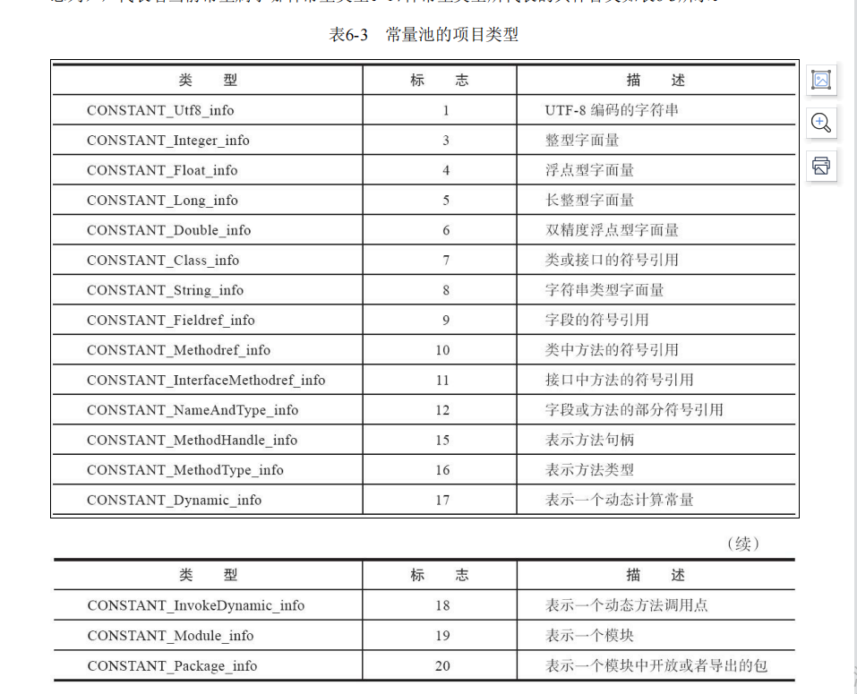

# class文件结构

## class结构

- 任何一个Class文件都对应着唯一的一个类或接口的定义信息[1]，但是反过来说，类或接口并不一定都得定义在文件里（譬如类或接口也可以动态生成，直接送入类加载器中, 比如代理生成的）
- Class文件是一组以8个字节为基础单位的二进制流,各个数据项目都严格按照顺序紧凑地排列在文件之中,中间没有添加任何分隔符。当遇到需要占用8个字节以上空间的数据项时,则会按照高位在前的方式分隔成若干个8个字节进行存储
- Class文件采用一种类似C语言结构体的伪结构来存储数据，只有 无符号数 和 表
- 无符号数属于基本的数据类型，以 u1,u2,u4,u8来分别代表1，2，4，8个字节的无符号数，无符号数可以用来描述数字，索引引用，数量值或者按照UTF-8编码构成的字符串
- 表是由多个无符号数或者其他表作为数据项构成的符合数据类型，为了便于区分，所有的表命名都习惯的以 _info 结尾，表用来描述由层次关系的符合结构数据，整个class文件本质上可以视为一张表.
- class文件的头4个字节称为魔数,唯一作用是确定该文件是否为一个虚拟机能接受的class文件。 5到6字节是 次版本号(Minor Version),7到8字节是主版本号(Major Version)


## 常量池

常量池可以比喻为class文件里的资源仓库，它是class文件结构中与其他项目关联最多的数据，通常也是占用class文件空间最大的数据项目之一，另外，它还是class文件中第一个出现的表类型数据项目

由于常量池中常量的数量不固定,所以在常量池入口需放置一个u2类型的数据,代表常量池容量计算值(constant_pool_count),该数值是从1开始，不是0开始

常量池主要存放的两大常量: 	 字面量(Literal) 和 符号引用(Sysbolic References)。

当虚拟机做类加载时，将会从常量池获得对应的符号引用，再在类创建时或运行时解析、翻译到具体的内存地址之中

常量池每一项常量都是一个表，一共有17种类型，这17种常量类型各自有着完全独立的数据结构



使用 javap -verbose TestStr.class 来进行分析

```tex
Classfile /D:/coding_record/github_self/basic-java-io/basic-java-clazz/target/classes/com/yang/basicjavaclazz/clazz/TestStr.class
  Last modified 2022-11-28; size 407 bytes
  MD5 checksum 25cd045cfe2f4e35cc3370a6e7806709
  Compiled from "TestStr.java"
public class com.yang.basicjavaclazz.clazz.TestStr
  minor version: 0
  major version: 52
  flags: ACC_PUBLIC, ACC_SUPER
Constant pool:
   #1 = Methodref          #4.#18         // java/lang/Object."<init>":()V
   #2 = Fieldref           #3.#19         // com/yang/basicjavaclazz/clazz/TestStr.m:I
   #3 = Class              #20            // com/yang/basicjavaclazz/clazz/TestStr
   #4 = Class              #21            // java/lang/Object
   #5 = Utf8               m
   #6 = Utf8               I
   #7 = Utf8               <init>
   #8 = Utf8               ()V
   #9 = Utf8               Code
  #10 = Utf8               LineNumberTable
  #11 = Utf8               LocalVariableTable
  #12 = Utf8               this
  #13 = Utf8               Lcom/yang/basicjavaclazz/clazz/TestStr;
  #14 = Utf8               inc
  #15 = Utf8               ()I
  #16 = Utf8               SourceFile
  #17 = Utf8               TestStr.java
  #18 = NameAndType        #7:#8          // "<init>":()V
  #19 = NameAndType        #5:#6          // m:I
  #20 = Utf8               com/yang/basicjavaclazz/clazz/TestStr
  #21 = Utf8               java/lang/Object
{
  public com.yang.basicjavaclazz.clazz.TestStr();
    descriptor: ()V
    flags: ACC_PUBLIC
    Code:
      stack=1, locals=1, args_size=1
         0: aload_0
         1: invokespecial #1                  // Method java/lang/Object."<init>":()V
         4: return
      LineNumberTable:
        line 10: 0
      LocalVariableTable:
        Start  Length  Slot  Name   Signature
            0       5     0  this   Lcom/yang/basicjavaclazz/clazz/TestStr;

  public int inc();
    descriptor: ()I
    flags: ACC_PUBLIC
    Code:
      stack=2, locals=1, args_size=1
         0: aload_0
         1: getfield      #2                  // Field m:I
         4: iconst_1
         5: iadd
         6: ireturn
      LineNumberTable:
        line 14: 0
      LocalVariableTable:
        Start  Length  Slot  Name   Signature
            0       7     0  this   Lcom/yang/basicjavaclazz/clazz/TestStr;
}
SourceFile: "TestStr.java"
```


## 字节码指令

### 加载和存储指令

- 将一个局部变量加载到操作栈：iload、iload_<n>、lload、lload_<n>、fload、fload_<n>、dload、

  dload_<n>、aload、aload_<n>

- ·将一个数值从操作数栈存储到局部变量表：istore、istore_<n>、lstore、lstore_<n>、fstore、

  fstore_<n>、dstore、dstore_<n>、astore、astore_<n>

- 将一个常量加载到操作数栈：bipush、sipush、ldc、ldc_w、ldc2_w、aconst_null、iconst_m1、

  iconst_<i>、lconst_<l>、fconst_<f>、dconst_<d>

- 扩充局部变量表的访问索引的指令：wide

### 运算符

- 加法指令：iadd、ladd、fadd、dadd
- 减法指令：isub、lsub、fsub、dsub
- 乘法指令：imul、lmul、fmul、dmul
- 除法指令：idiv、ldiv、fdiv、ddiv
- 求余指令：irem、lrem、frem、drem
- 取反指令：ineg、lneg、fneg、dneg
- 位移指令：ishl、ishr、iushr、lshl、lshr、lushr
- 按位或指令：ior、lor
- 按位与指令：iand、land
- 按位异或指令：ixor、lxor
- 局部变量自增指令：iinc
- 比较指令：dcmpg、dcmpl、fcmpg、fcmpl、lcmp

### 类型转换指令

类型转换指令可以将两种不同的数值类型进行转换

Java虚拟机直接支持（即转换时无须显式的转换指令）以下数值类型的宽化类型转换（Widening Numeric Conversion，即小范围类型向大范围类型的安全转换）：

- int 类型到 long,float或者double类型
- long类型到float,double类型
- float类型到double类型

与之相对的，处理窄化类型转换（Narrowing Numeric Conversion）时，就必须显式地使用转换指令来完成，这些转换指令包括i2b、i2c、i2s、l2i、f2i、f2l、d2i、d2l和d2f。窄化类型转换可能会导致转换结果产生不同的正负号、不同的数量级的情况，转换过程很可能会导致数值的精度丢失。

### 对象创建和指令访问

- 创建类实例的指令: new
- 创建访问数组的指令:  newarray、anewarray、multianewarray
- 访问类字段(static字段,或者称为类变量)  和 实例字段(非static字段,或者称为实例变量)的指令:  getfield, putfield,getstatic,putstatic
- 把一个数组元素加载到操作数栈的指令：baload、caload、saload、iaload、laload、faload、daload、aaload
- 将一个操作数栈的值储存到数组元素中的指令：bastore、castore、sastore、iastore、fastore、dastore、aastore
- 取数组长度的指令:  array length
- 检查类实例类型的指令：instanceof、checkcast

### 操作数栈管理指令

- 将操作数栈的栈顶一个或两个元素出栈, pop, pop2
- 复制栈顶一个或两个数值并将复制值或者双份的复制值重新压入栈顶:  dup,dup2,dup_x1,dup2_x1,dup_x2,dup2_x2
- 将栈最顶端的两个数值互换:  swap

### 控制转移指令

- 条件分支：ifeq、iflt、ifle、ifne、ifgt、ifge、ifnull、ifnonnull、if_icmpeq、if_icmpne、if_icmplt、if_icmpgt、if_icmple、if_icmpge、if_acmpeq和if_acmpne

- 复合条件分支：tableswitch、lookupswitch

- 无条件分支：goto、goto_w、jsr、jsr_w、ret

### 方法调用和返回指令

  方法调用指令与数据类型无关,而方法返回指令是根据返回值的类型区分的，包括ireturn(当返回值是boolean,byte,char,short和int类型时使用)，lreturn，freturn，dreturn和areturn，还有一条return指令供声明void的方法，实例初始化方法，类和接口的类初始化方法

- invokevirtual指令：用于调用对象的实例方法，根据对象的实际类型进行分派（虚方法分派），这也是Java语言中最常见的方法分派方式
- ·invokeinterface指令：用于调用接口方法，它会在运行时搜索一个实现了这个接口方法的对象，找出适合的方法进行调用
- invokespecial指令：用于调用一些需要特殊处理的实例方法，包括实例初始化方法、私有方法和父类方法
- invokestatic指令：用于调用类静态方法（static方法）
- invokedynamic指令：用于在运行时动态解析出调用点限定符所引用的方法。并执行该方法。前面四条调用指令的分派逻辑都固化在Java虚拟机内部，用户无法改变，而invokedynamic指令的分派逻辑是由用户所设定的引导方法决定的

### 异常处理指令

​    处理异常语句不由字节码指令来实现的，而是采用异常表来实现的

- 显示抛出异常的操作(throw语句)都由athrow指令来实现，除了用throw语句显示抛出异常的情况外，还规定了许多运行时异常会在其他Java虚拟机指令检测到异常状况时自动抛出

  ### 同步指令

支持方法级的同步和方法内部一段指令序列的同步，这两种同步结果都是使用管程(Monitor)来实现的

- 方法级的同步是隐式的,无须通过字节码指令来控制,它实现在方法调用和返回操作之中。会从常量池中的方法表结构的ACC_SYNCHRONIZED访问标志得知一个方法是否被声明为同步方法。
- 方法内部一段指令序列的同步，方法中调用过的每条monitorenter指令都必须有其对应的monitorexit指令

  