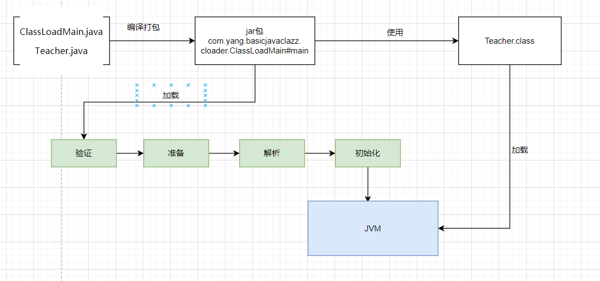

# 类加载

## 生命周期

1. 加载(Loading)
2. 验证(Verification)
3. 准备(Preparetion)
4. 解析(Resolution)
5. 初始化(Initialization)
6. 使用(Using)
7. 卸载(Unloading)

其中 , 验证/准备/解析 三个部分统称为 连接(Linking)

## 加载

### 何时加载

1. 遇到 new , getstatic, putstatic 和 invokestatic 这四条字节码指令时,如果类型没有进行过初始化,则需要先触发其初始化阶段.
   - 使用 new 关键字实例化对象
   - 读取或者设置一个类型的静态字段(被final修饰,已在编译期把结果放入常量池的静态字段除外)的时候
   - 调用一个类型的静态方法的时候
2. 使用 java.lang.reflect包的时候对类型进行反射调用的时候,如果类型没有进行初始化,则需要触发其初始化
3. 当初始化类的时候，如果发现其子类还没有进行初始化，则需要先触发其父类的初始化
4. 当虚拟机启动时，用户需要指定一个启动类（main方法），虚拟机会先初始化这个主类
5. 当使用JDK 7新加入的动态语言支持时，如果一个java.lang.invoke.MethodHandle实例最后的解析结果为REF_getStatic、REF_putStatic、REF_invokeStatic、REF_newInvokeSpecial四种类型的方法句柄，并且这个方法句柄对应的类没有进行过初始化，则需要先触发其初始化
6. 当一个接口定义了default关键字修饰的接口方法时,如果有这个接口的实现类发生了初始化，那该接口要在其之前初始化

**注意: 常量传播优化,讲静态常量直接存储在 使用类 的常量池中,实际都被转化为 类 对自身的常量池的引用。**

### 案例说明

比如我们经常写的一个类的main启动, 首先是需要通过类加载器把主类加载到JVM中

```java
public class ClassLoadMain {

    public static final String name = "BaoYang";
    public static final int age = 24;

    Teacher teacher = new Teacher();

    public int add(){

        int a = 1, b =1 ;
        int c = a + b;
        System.out.println("c的结果是: " + c);
        return c;

    }

    public static void main(String[] args) {

        ClassLoadMain classLoadMain = new ClassLoadMain();
        classLoadMain.add();

    }

}
```

通过执行流程如下


其中 loadClass 的类加载过程有如下几步:

 加载 >> 验证 >> 准备 >> 解析 >> 初始化 >> 使用 >> 卸载

- 加载:  从磁盘上查找并通过io读入字节码,使用到类时才会加载，例如调用类的main()方法，new对象等等，在加载阶段会在内存中生成一个代表这个类的java.lang.class对象，作为方法区这个类的各种数据的访问入口。

  - 通过一个类的全限定名来获取定义此类的二进制字节流
  - 将这个字节流所代表的静态存储结构转化为方法区的运行时数据结构
  - 在内存中生成一个代表这个类 java.lang.Class 对象,作为方法区 这个类的各自数据的访问入口
- 验证:  检验字节码文件的准确性

  1. 文件格式验证

     - 是否魔数 0xCAFEBABE开头

     - 主次版本号是否在当前java虚拟机接受范围之内

     - 常量池的常量中是否有不被支持的常量类型

     - 指向常量的各种索引值中是否有指向不存在的常量或不符合类型的常量。

     - CONSTANT_Utf8_info型的常量中是否有不符合UTF-8编码的数据。

     - Class文件中各个部分及文件本身是否有被删除的或附加的其他信息。

     - 等等。。。
  2. 元数据验证(字节码描述的信息进行语义分析)

     - 这个类是否有父类(除了java.lang.Object之外,所有的类都应当有父类)
     - 这个类的父类是否继承了不允许被继承的类（被final修饰的类）。
     - 如果这个类不是抽象类，是否实现了其父类或接口之中要求实现的所有方法。
     - 类中的字段、方法是否与父类产生矛盾（例如覆盖了父类的final字段，或者出现不符合规则的方法重载，例如方法参数都一致，但返回值类型却不同等）。
     - ....等等
  3. 字节码验证(数据流分析和控制流分析,确定程序语义是合法的,逻辑是符合的)
  4. 符号引用验证(对类自身外（常量池中的各种符号引用）的各类信息进行匹配校验)
     - 通过字符串中描述的全限定名是否能找到对应的类
     - 指定类中是否存在符合方法的字段描述以及简单名称所描述的字段和方法
     - 符号引用中的类、字段、方法的可访问性（private、protected、public、<package>）是否可被当前类访问
- 准备:  将类的静态变量分配内存,并赋予默认值
- 解析:  将符号的引用替换为直接引用,该阶段会把一些静态方法(符号引用,比如main方法)替换为指向数据所存内存的指针或句柄等(直接引用),这是所谓的静态链接过程(类加载期间完成),动态替换是在程序运行期间完成将符号引用替换为直接引用.
- 初始化:  对类的静态变量初始化为指定的值,执行静态代码块



类被加载到方法区中后主要包括 运行时常量池,类型信息,字段信息,方法信息,类加载器的引用,对应class实例的引用信息.

类加载器引用: 这个类到类加载器实例的引用

对应class引用: 类加载器在加载类信息放到方法区中后,会创建一个对应的class类型的对象放到heap中,作为开发人员访问方法区中类定义的入口和切入点

注意点:  主类在运行过程中如果使用到了其他类，会逐步加载这些类，jar或者war包里的类不是一次性全部加载的,是使用到时才会加载

## 类加载和双亲委派机制

- 引导类加载器：  负责加载支撑jvm运行的位于jre的lib目录下的核心类库,比如 rt.jar , charset.jar等
- 扩展包加载器：  负责加载支撑jvm运行的位于jre的lib包目录下的ext扩展目录中的jar类包
- 应用程序类加载器:  负责加载classPath路径下的类包，主要就是加载自己写的那些类
- 自定义加载器： 负责加载用户自定义的路径下的类包

## 类加载初始化过程

JVM会启动实例sun.misc.Launcher

Launcher采用单例模式,保证jvm虚拟机内存中只有一个 Launcher 实例

在 Launcher 构造方法内部, 创建了两个类加载器,分别是 ExtClassLoader(扩展类加载器) 和 AppClassLoader(应用类加载器)

```java
    public Launcher() {
        Launcher.ExtClassLoader var1;
        try {
            // 构造扩展类加载器,构造的过程中使用(ClassLoader)null将父类的加载器设置为null
            // super(getExtURLs(var1), (ClassLoader)null, Launcher.factory);
            var1 = Launcher.ExtClassLoader.getExtClassLoader();
        } catch (IOException var10) {
            throw new InternalError("Could not create extension class loader", var10);
        }

        try {
            // 构造应用类加载器,在构造的过程中将其父类加载器设置为 ExtClassLoader
            // Launcher的loader属性值是 AppClassLoader,我们一般都是用这个类加载器来加载我们自己写的应用程序
            this.loader = Launcher.AppClassLoader.getAppClassLoader(var1);
        } catch (IOException var9) {
            throw new InternalError("Could not create application class loader", var9);
        }

        Thread.currentThread().setContextClassLoader(this.loader);
        String var2 = System.getProperty("java.security.manager");
        if (var2 != null) {
            SecurityManager var3 = null;
            if (!"".equals(var2) && !"default".equals(var2)) {
                try {
                    var3 = (SecurityManager)this.loader.loadClass(var2).newInstance();
                } catch (IllegalAccessException var5) {
                } catch (InstantiationException var6) {
                } catch (ClassNotFoundException var7) {
                } catch (ClassCastException var8) {
                }
            } else {
                var3 = new SecurityManager();
            }

            if (var3 == null) {
                throw new InternalError("Could not create SecurityManager: " + var2);
            }

            System.setSecurityManager(var3);
        }

    }
```


## 双亲委派

### 双亲委派流程


加载某个类的时,会先委托父加载器寻找目标类,找不到再委托上层父类加载器加载，如果所有的父类加载器在自己的加载类路径下都找不到目标类，则在自己的类加载路径中查找并载入目标类

双亲委派:  先找父类,不行再有子类自加载

### AppClassLoader的loadCLass

AppClassLoader中的loadCLass

```java
//   
public Class<?> loadClass(String var1, boolean var2) throws ClassNotFoundException {
            int var3 = var1.lastIndexOf(46);
            if (var3 != -1) {
                SecurityManager var4 = System.getSecurityManager();
                if (var4 != null) {
                    var4.checkPackageAccess(var1.substring(0, var3));
                }
            }

            if (this.ucp.knownToNotExist(var1)) {
                Class var5 = this.findLoadedClass(var1);
                if (var5 != null) {
                    if (var2) {
                        this.resolveClass(var5);
                    }

                    return var5;
                } else {
                    throw new ClassNotFoundException(var1);
                }
            } else {
                // 调用ClassLoader的loadCLass方法
                return super.loadClass(var1, var2);
            }
        }
```

ClassLoader的loadCLass方法

```java
    protected Class<?> loadClass(String name, boolean resolve)
        throws ClassNotFoundException
    {
        // 根据 类名字 来进行上锁
        synchronized (getClassLoadingLock(name)) {
            // First, check if the class has already been loaded
            // 第一步,查找该类是否已经被加载
            Class<?> c = findLoadedClass(name);
            if (c == null) {
                // null则是没有加载
                long t0 = System.nanoTime();
                try {
                    if (parent != null) {
                        // 如果类加载器不是null，则委派给父加载器进行加载
                        c = parent.loadClass(name, false);
                    } else {
                        // 如果父加载器为null,则委托引导类加载器加载该类
                        c = findBootstrapClassOrNull(name);
                    }
                } catch (ClassNotFoundException e) {
                    // ClassNotFoundException thrown if class not found
                    // from the non-null parent class loader
                }

                if (c == null) {
                    // 如果上面还是全部没有加载到
                    // If still not found, then invoke findClass in order
                    // to find the class.
                    long t1 = System.nanoTime();
                    // 都会调用 URLCLassLoader的findCLass方法在加载器的类路径里查找并加载该类
                    c = findClass(name);

                    // this is the defining class loader; record the stats
                    sun.misc.PerfCounter.getParentDelegationTime().addTime(t1 - t0);
                    sun.misc.PerfCounter.getFindClassTime().addElapsedTimeFrom(t1);
                    sun.misc.PerfCounter.getFindClasses().increment();
                }
            }
            if (resolve) {
                resolveClass(c);
            }
            return c;
        }
    }
```

### 双亲委派机制好处

1. 沙箱安全机制:  自己写的jre核心类库不会被加载,这样便可以防止核心api库被篡改
2. 避免类的重复加载, 当父类已经加载了该类时,就没必要子ClassLoader再加载一次,保证被加载类的唯一性
3. 全盘委托机制:  是指一个ClassLoader装载一个类时，除非显式的使用宁外一个ClassLoader，该类所依赖及引用的类也由这个ClassLoader载入

### 自定义类加载器

只需要继承java.lang.ClassLoader类, 主要重写 findClass方法

1.  loadClass(String,boolean)
2. findClass : 默认实现是空方法