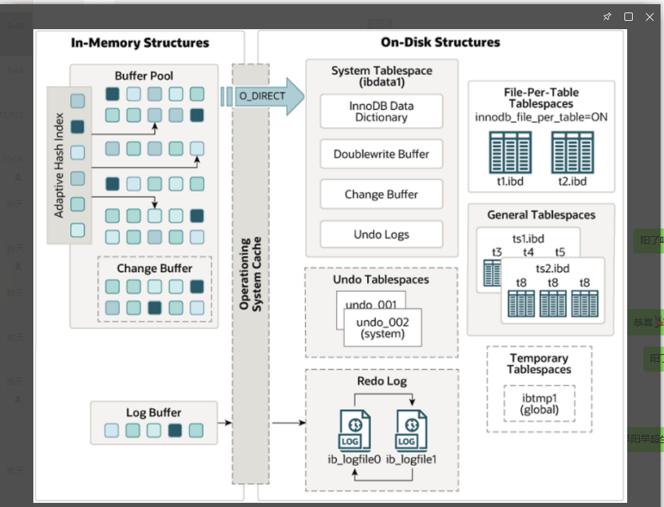
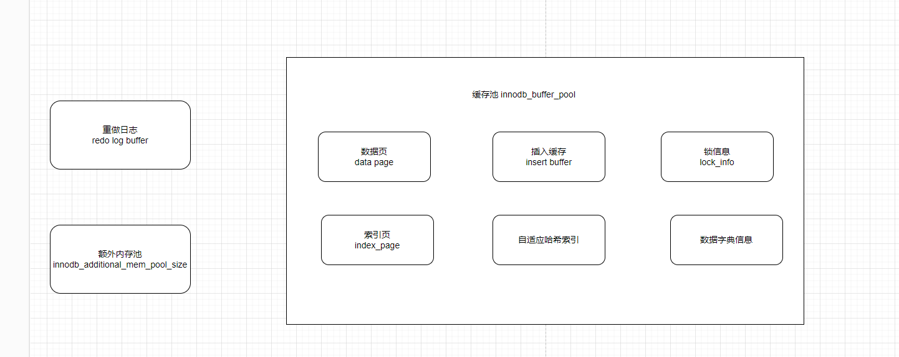
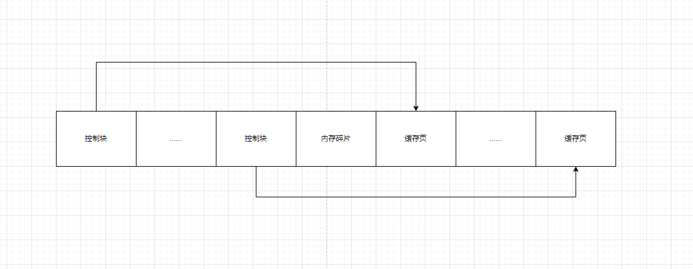
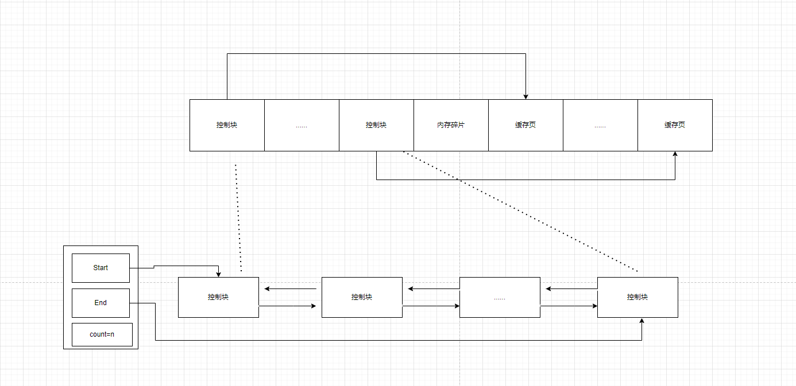

# Mysql的buffer pool

## Innodb体系图




## Buffer pool

Innodb为了缓存磁盘的页，在mysql服务器启动向操作系统申请了一片连续的内存，该内存叫 Buffer pool（缓冲池）。默认情况下 128M 大小。

查看大小指令

```sql
show variables like 'innodb_buffer_pool_size';
```



读取数据时，先从缓冲池中查看是否数据的页(page)存在，不存在的话去磁盘上检索，查到后缓存到innodb_buffer_pool中，同理，插入修改删除操作也是先操作缓存里数据，之后再以一定的频率更新到磁盘上，这个刷盘的机制叫checkpoint

## Change Buffer

- 修改数据库数据时，如果数据页刚还在缓存页，可以修改缓存区的数据页为脏页
- 如果数据页不在缓冲区，就需要把数据页从磁盘加载到缓存区，然后进行修改。对于写多读少的场景，会产生大量的磁盘IO，影响数据库的性能。

Change Buffer对数据更新过程有加速作用，如果数据页没有在内存中，会将更新操作缓存到Change buffer中，这样就不需要从磁盘读入这个数据页，减少IO操作，提高了性能。先将更新操作，记录在Change Buffer 中，之后再进行 merge,真正进行数据更新。

## 内部组成

Buffer pool中默认缓存页大小和磁盘上默认的页大小是一样的，16k。

为了更好的管理buffer pool的缓存页，innodb为每一个缓存页都创建了一些所谓的控制信息，这些控制信息包括页所属的表空间编号，页号，缓存页在buffer pool中的地址，链表节点信息，一些锁信息以及LSN信息，还有一些别的控制信息。

每个页缓存页对应的控制信息占用的内存大小是相同的，称为 控制块。控制块和缓存页是一一对应的，都被存放在buffer pool中

每个控制块占缓存页大小的5%



## free链表

问题: 怎么区分Buffer Pool中那些缓存页是空闲的,那些是已经被使用了的呢?

​		  我们将所有空闲的缓存页对应的控制块作为一个节点,放在一个链表中,那么这个链表就可以被称作为free链表(空闲列表).



## flush链表

如果我们修改了buffer pool中某个缓存页的数据,那它和磁盘上的页不一致了,这样的缓存页也成为 脏页(dirty page).

问题: 

- 如果每发生一次修改的话,就立刻同步到磁盘上对应的页上,但是频繁的往磁盘上中写数据会严重影响程序的性能.所以每次修改缓存页的时候,并不着急立刻把修改的同步到磁盘上,而是在未来某个时间点进行同步.
- 如果不立刻同步的话,那怎么区别buffer pool中那些页是脏页,那些页从来没被修改过呢?

所以就需要一个存储脏页的链表来进行记录,凡是修改过的缓存页对应的控制块,都作为一个节点加入到一个链表中,这个链表节点对应的缓存页都需要被刷新到磁盘上,所以也叫flush链表,其结构和free链表一样


## LRU链表(Least Recently Used)

问题:  Buffer Pool对应的内存大小也是有限的,如果缓存的页占用大小超过了Buffer Pool大小,也就是free链表中也没有多余的空闲缓存页时候,该怎么处理?

​           将旧的缓存页从buffer pool中移除,然后再将新的放入进来.

普通的LRU产生的问题:

- 容易出现预读失效

   预读(Read-Ahead),提前把页放入到缓冲池,但最终mysql并没有从页中读取数据,称为预读失败

- 容易出现缓冲池污染

  缓冲池污染: 当某一个sql的时候,要扫描大量数据时,可能导致缓冲池的所有页都替换出去,导致大量热数据被换出,mysql性能急剧下降,这种情况叫缓冲池污染

Mysql的buffer pool为了处理这2个问题,在普通的LRU基础上做了一些优化,尽量让真正的热点页可以在buffer pool里存活时间更长

Mysql的buffer pool处理方法: 头部的是新生代,尾部的是老生代

- 如果不在Buffer Pool中,在把该页从磁盘加载到Buffer Pool中的缓存页时,就把该缓存页对应的控制块作为节点放入LRU链表的头部
- 如果该缓存页存在Buffer Pool中,则直接把该页对应的控制块移动到LRU链表头部

只要我们使用到某个缓存页,就把该缓存页调整到LRU链表的头部,这样LRU链表尾部就是最近最少使用的缓存页,所以当Buffer Pool中的空闲缓存页使用完时,到LRU链表的尾部找些缓存页进行淘汰

## 刷新脏页到磁盘

1. 从LRU链表的冷数据中刷新一部分缓存页到磁盘.

   从LRU尾部开始扫描一些缓存页,扫描的缓存页数量可以通过系统变量innodb_lru_scan_depth来指定,如果从这里发现了脏页,会把他们刷新到磁盘.称为BUF_FLUSH_LRU

2. 从flush链表中刷新一部分页面到磁盘

   后台线程会定时从flush刷新一部分缓存页到磁盘,刷新的速率取决于当时系统是不是很繁忙.称为BUF_FLUSH_LIST

## 多个Buffer Pool实例

本质： Innodb向操作系统申请了一块连续的内存空间，多线程的情况下，访问buffer pool中的各链表都需要加锁处理，在Buffer pool特别大而且多线程并发访问情况下，单一的buffer pool可能会影响请求的访问速度。

​            所以在Buffer Pool特别大的时候，可以拆分成若干个小的Buffer pool，每个buffer pool都称为一个实例，都是独立的，独立的申请内存空间，独立的管理各种链表，所以在多线程并发访问时并不会相互影响，从而提高并发处理能力。

## 查看Buffer Pool的状态信息

```sql
show engine innodb status\G;
```

将Buffer Pool And Memory结果复制出来：

```
----------------------
BUFFER POOL AND MEMORY
----------------------
Total large memory allocated 0
Dictionary memory allocated 2523782
Buffer pool size   8192
Free buffers       1039
Database pages     7060
Old database pages 2588
Modified db pages  0
Pending reads      0
Pending writes: LRU 0, flush list 0, single page 0
Pages made young 5477, not young 20908
0.00 youngs/s, 0.00 non-youngs/s
Pages read 1331, created 10341, written 57134
0.00 reads/s, 0.00 creates/s, 0.00 writes/s
Buffer pool hit rate 1000 / 1000, young-making rate 0 / 1000 not 0 / 1000
Pages read ahead 0.00/s, evicted without access 0.00/s, Random read ahead 0.00/s
LRU len: 7060, unzip_LRU len: 0
I/O sum[0]:cur[0], unzip sum[0]:cur[0]
```

- Total large memory allocated： 代表Buffer Pool向操作系统申请的连续内存空间大小，包括全部控制块，缓存页，以及碎片的大小
- Dictionary memory allocated：  为数据字典信息分配的内存空间大小，注意这个内存空间和 Buffer Pool 没啥关系，不包括在 Total memory allocated 中。
- Buffer pool size： 代表该Buffer Pool可以容纳多少缓存页，单位是页
- Free buffers： 当前Buffer Pool还有多少空闲缓存页，也就是free链表中还有多少节点
- Database pages：代表LRU链表中的页的数量，包含了young和old两个区域的节点数量
- Old database pages： LRU链表old区域的节点数量
- Modified db pages： 脏页数量，包含了young和old两个区域的节点数量
- Pending reads： 正在等待从磁盘上加载到Buffer Pool中的页面数量
- Pending writes：
  - LRU： 即将从LRU链表中刷新到磁盘中的页面数量
  - flush list：即将从flush链表中刷新到磁盘中的页面数量
  - single page：即将以单个页面的形式刷新到磁盘中的页面数量
- Pages made young： LRU链表中曾经从old区域移动到young区域头部的节点数量
- Pages made not young： 在将innodb_old_blocks_time设置的值大于0时，首次访问或者后续访问某个处在old区域的节点时由于不符合时间间隔的限制而不能将其移动到young区域头部时，page made not young的值会加1
- youngs/s： 每秒从old区域移动到young区域头部的节点数量
- non-youngs/s： 每秒由于不满足时间限制而不能从old区域移动到young区域头部的节点数量
- Pages read,created,written:  代表读取，创建，写入了多少页，后续跟着读取，创建，写入的速率
- Buffer pool hit rate：代表在过去某段时间，平均访问1000次页面，有多少次该页面已经被缓存到Buffer Pool了
- young-making rate： 表示在过去某段时间，平均访问 1000 次页面，有多少次访问使页面移动到 young 区域的头部了
- not：表示在过去某段时间，平均访问 1000 次页面，有多少次访问没有使页面移动到 young 区域的头部。
- LRU len： 代表LRU链表节点的数量
- unzip_LRU len： 代表unzip_LRU链表中节点数量
- I/O sum：最近 50s 读取磁盘页的总数。
- I/O cur：现在正在读取的磁盘页数量。
- I/O unzip sum：最近 50s 解压的页面数量。
- I/O unzip cur：正在解压的页面数量。