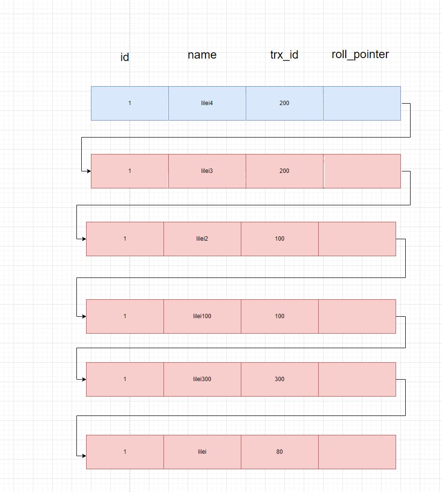

# MVCC

Multi-Version Concurrency Control,即多版本并发控制。

对一行数据的读和写两个操作默认是不会通过加锁互斥来保证隔离性的，避免了频繁加锁互斥，而在串行化隔离级别为了保证较高的隔离性是通过将所有操作加锁互斥来实现的。

## 演示SQL

依次开启五个窗口,一次执行的顺序

| # Transaction 100                                | # Transaction 200                                | # Transaction 300                                  | # select 1                                                   | # select 2                                                   |
| ------------------------------------------------ | ------------------------------------------------ | -------------------------------------------------- | ------------------------------------------------------------ | ------------------------------------------------------------ |
| begin;                                           | begin;                                           | begin;                                             | begin;                                                       | begin;                                                       |
| update test set c1 = '123' where id =1;          |                                                  |                                                    |                                                              |                                                              |
|                                                  | update test set c1 = '666' where id =5;          |                                                    |                                                              |                                                              |
|                                                  |                                                  | update account set name = 'lilei300' where id = 1; |                                                              |                                                              |
|                                                  |                                                  | commit;                                            |                                                              |                                                              |
|                                                  |                                                  |                                                    | select name from account where id = 1;   --readview:[100,200], 300    lilei300 |                                                              |
|                                                  |                                                  |                                                    |                                                              |                                                              |
| update account set name = 'lilei1' where id = 1; |                                                  |                                                    |                                                              |                                                              |
| update account set name = 'lilei2' where id = 1; |                                                  |                                                    |                                                              |                                                              |
|                                                  |                                                  |                                                    | select name from account where id = 1;   --readview:[100,200], 300    lilei300 |                                                              |
| commit;                                          | update account set name = 'lilei3' where id = 1; |                                                    |                                                              |                                                              |
|                                                  | update account set name = 'lilei4' where id = 1; |                                                    |                                                              |                                                              |
|                                                  |                                                  |                                                    | select name from account where id = 1;   --readview:[100,200], 300    lilei300 | select name from account where id = 1;   --readview:[200], 300    lilei2 |
|                                                  | commit;                                          |                                                    |                                                              |                                                              |

## 版本链

上面的演示sql在mvcc的undo log里面形成一个版本链

 利用隐藏的二个字段， trx_id 和 roll_pointer把这些undo日志串联起来

