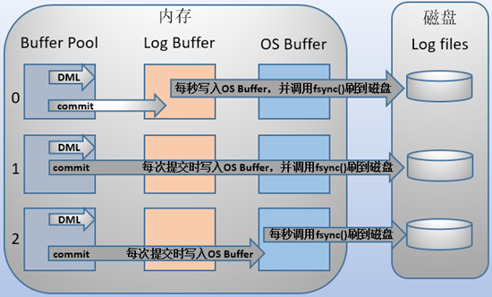
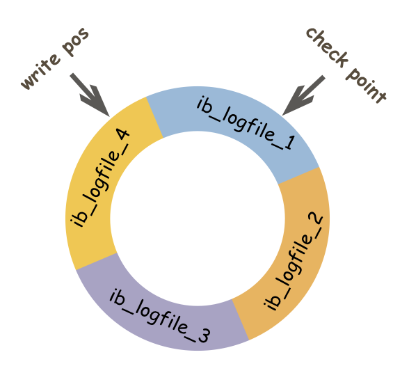

# MYSQL三大日志

## redo log

### 问题

持久性：只是事务提交成功，那么对数据库做的修改就被永久保存下来，不可能因为任何原因再回到原来的状态

- 简单做法是，每次事务提交的时候，将该事务涉及的数据页全部刷新到磁盘中，但是这样会有严重的性能问题。
  1. 一个事务可能只修改了一个数据页的几个字节，这个时候将完整的数据页刷到磁盘的话，太浪费资源了
  2. 一个事务可能涉及多个数据页，并且这些数据页在物理上并不连续，使用随机IO写入性能太差

因此，redo log只记录事务对数据页做了哪些操作，这样就能完美地解决性能问题了(相对而言文件更小并且是顺序IO)。

### 基本概念

- 内存中的日志缓冲(redo log buffer)
- 磁盘上的日志文件(rede log file)

WAL: 先将记录写入 redo log buffer，后续某个时间再一次性将多个操作记录写入到redo log file。mysql将redo log buffer 写入 redo log file的机制，可以通过innodb_flush_log_at_trx_commit参数配置，参数含义如下

1.  0（延迟写）事务提交时不会将redo log buffer中日志写入到os buffer，而是每秒写入os buffer并调用fsync()写入到redo log file中。也就是说设置为0时是(大约)每秒刷新写入到磁盘中的，当系统崩溃，会丢失1秒钟的数据。
2. 1（实时写，实时刷）事务每次提交都会将redo log buffer中的日志写入os buffer并调用fsync()刷到redo log file中。这种方式即使系统崩溃也不会丢失任何数据，但是因为每次提交都写入磁盘，IO的性能较差。
3. 2（实时写，延迟刷）每次提交都仅写入到os buffer，然后是每秒调用fsync()将os buffer中的日志写入到redo log file。

### 记录形式

write pos表示rede log当前记录的LSN(逻辑序号)位置，check point表示数据页更改记录刷盘后对应redo log所处的LSN位置。write pos 和 check point之间的部分redo log空着的部分，用于记录新的记录，check point到write pos之间是redo log待落盘的数据页更改记录。当write pos追上check point时，会推动check point向前移动，空出位置再记录新的日志。

**在innodb中，既有redo log需要刷盘，还有数据页也需要刷盘，redo log存在的意义主要就是降低对数据页刷盘的要求**。

重启innodb时，首先检查磁盘中数据页的LSN，如果数据页的LSN小于日志中的LSN,则会从check point开始恢复。

有种情况，在宕机前，正处于check point的刷盘过程，且数据页的刷盘进度超过了日志页的刷盘进度，此时会出现数据页中记录的LSN大于日志的LSN，这时超出日志进度的部分将不会重做，因为这本身表示已经做过的事情，无需再重做。

## undo log

原子性底层通过undo log实现。

undo log主要记录了数据的逻辑变化，比如insert一条语句，对应一条delete语句的undo log，对于update，对应一条相反的update的undo log，这样发生错误时，就能回滚到事务之前的数据状态.

## binlog

