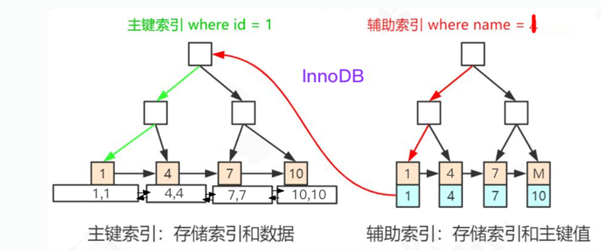
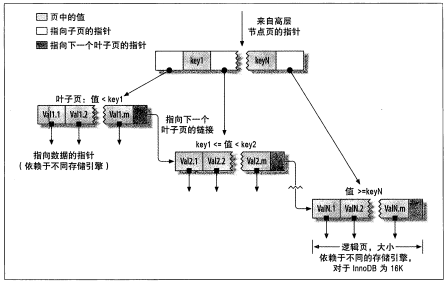
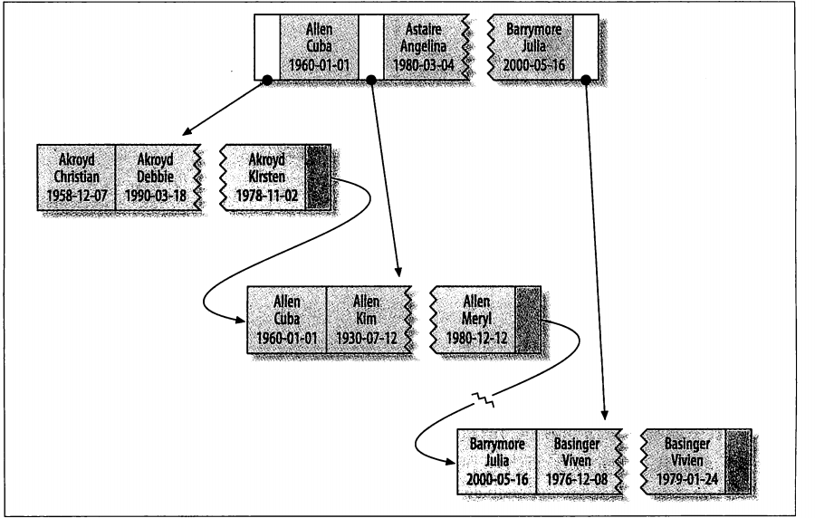
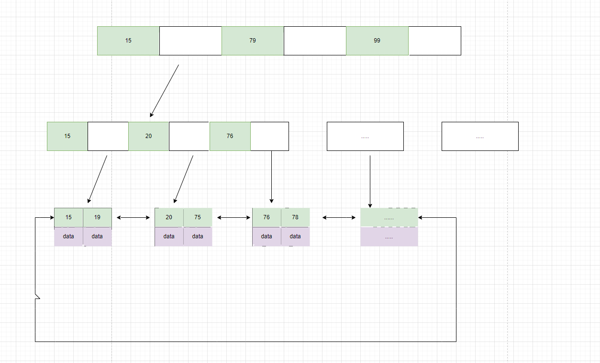

# 索引

索引是帮助mysql高效获取数据的排好序的数据结构

## 索引类型

- B-Tree+索引
- 哈希索引（只有memory引擎支持）
- 空间数据索引（R-Tree,可以用作地理数据存储）
- 全文索引

## 索引优点

1. 索引大大减少了服务器需要扫描的数据量
2. 所以帮助服务器避免排序和临时表
3. 索引可以将随机IO变为顺序IO

## 聚簇索引和非聚簇索引

聚簇索引： 将数据存储和索引放在了一块，找到索引也找到了数据

非聚簇索引：将数据存储和索引分来，索引结构的叶子节点指向了数据的对应行。

聚簇索引默认是主键，如果表中没有定义主键的话，innoDB会选择一个唯一的非空索引代替。如果没有这样的索引，innoDB会隐式定义一个主键来作为聚簇索引。

## 索引覆盖

- 索引条目通常远小于数据行大小，所以只需要读取索引，那么MySQL就会极大地减少数据访问量。
- 索引是按照值顺序存储的
- 一些存储引擎MyISAM在内存中只缓存索引，数据则依赖于操作系统来缓存，因此要访问数据需要一次系统调用。
- 由于InnoDB的聚簇索引，索引覆盖对InnoDB表特别有用。

查询的列，通过索引项的信息可直接返回的话，则该索引称之为查询SQL的覆盖索引，覆盖索引提升查询效率。

## B+Tree数据结构

从下图可以看出来，非叶子节点是不带数字，也就是存储的索引的具体指向

## 索引总结

- 索引列的数据长度能少则少，索引一定不是越多越好，越全越好。
- 匹配列前缀：最左匹配原则
- where中的 not in 和 <> 操作无法使用索引；匹配范围值，order by 也可用到索引；多用指定列查询，只返回自己想到的数据列，少用 select *
- 联合索引中如果不是按照最左开始查询，无法使用索引